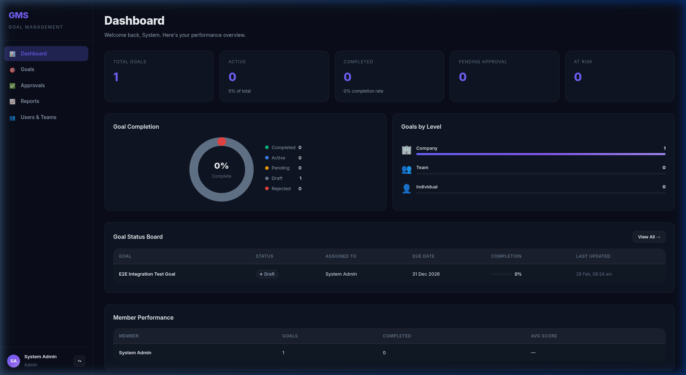
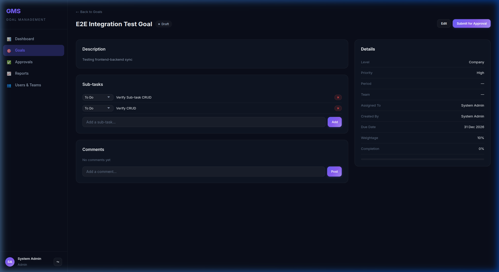
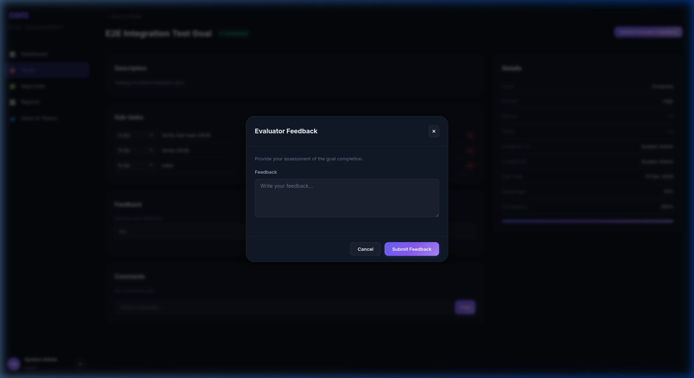
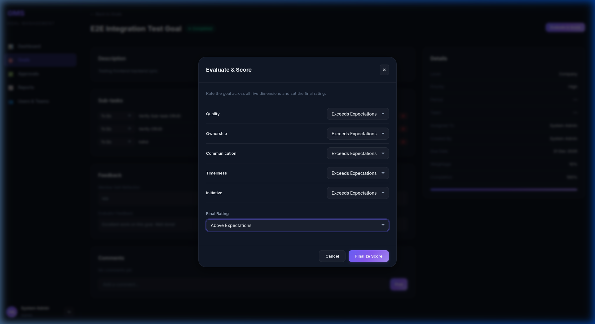
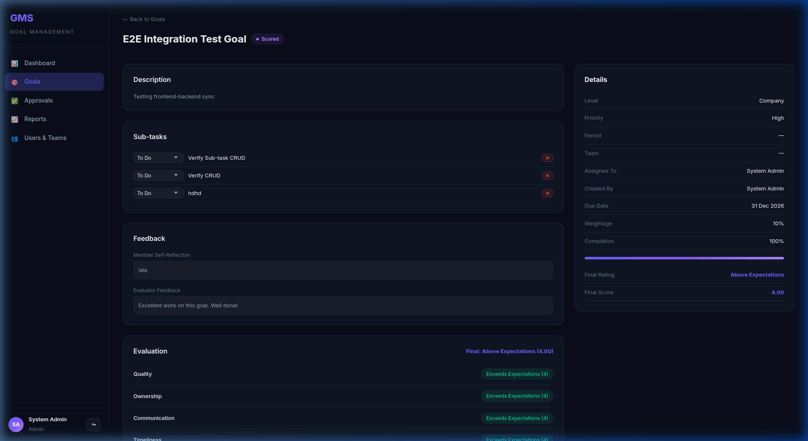
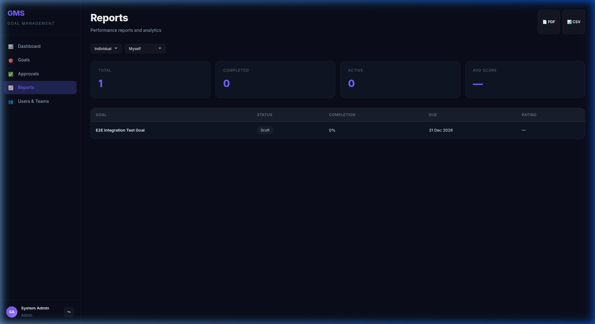

# Option 1: Docker (recommended)
docker-compose up --build

# Option 2: Local dev
# Terminal 1 — Start PostgreSQL and run backend:
cd backend && python3 manage.py migrate && python3 manage.py seed_data && python3 manage.py runserver

# Terminal 2 — Start frontend:
cd frontend && npm run dev

## Screenshots & Demos

### 1. Goal Dashboard

### 2. Goal Detail & Sub-tasks

### 3. Evaluator Feedback

### 4. Evaluate & Score

### 5. Reports

### Demos
*   **End-to-End Integration Test:** [View Demo Video](assets/gms_integration_verification_final.webp)
*   **Evaluation Modal Fix Verification:** [View Demo Video](assets/evaluation_modal_fix_test.webp)
# Test
# Test
